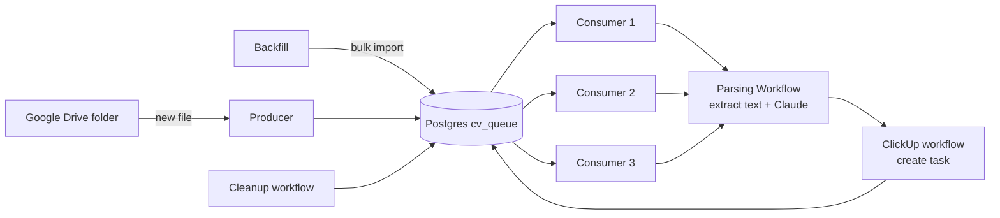

# n8n Resume → ClickUp Pipeline

An [n8n](https://n8n.io) automation that watches a Google Drive folder for new resumes, extracts structured candidate data with Claude, and creates a task in a ClickUp list — with a full self-hosted observability stack (Prometheus, Grafana, Tempo) included.

## What it does

1. **Producer** — a Google Drive trigger watches a folder for new files and inserts each one into a Postgres queue table (`cv_queue`). A separate **Backfill** workflow can bulk-import everything already in the folder.
2. **Consumers** (`Consumer 1`/`2`/`3`) — three identical scheduled workflows run in parallel. Each claims a batch of pending rows with `FOR UPDATE SKIP LOCKED` and a Data Table–based lock, so the three consumers never process the same file twice.
3. **Parsing Workflow** — downloads the file from Drive, extracts its text, and sends it to Claude (`claude-sonnet-5` via the Anthropic node) with a strict JSON-extraction system prompt. Claude returns structured fields: first/last name, phone, email, country, estimated total experience, estimated age, time zone, and a summary.
4. **ClickUp workflow** — creates a task in a ClickUp list from those fields, mapped onto ClickUp custom fields.
5. **Cleanup** — a scheduled workflow purges finished rows from the queue.
6. **Unlock / Error Trigger workflows** — one per consumer; if a consumer crashes mid-batch, these release its pipeline lock so processing isn't stuck.



## Stack

Defined in [`compose.yml`](./compose.yml) (based on n8n's [`get-n8n.sh`](https://get.n8n.io) installer):

- **n8n** + external **task runners** (Code node execution)
- **n8n sandbox service** (isolated Docker-in-Docker sandbox for the AI assistant / Code nodes)
- **PostgreSQL** — application queue table (`cv_queue`) and n8n's own data
- **SearXNG** — web search backend for n8n's built-in AI assistant
- **Prometheus** + **Grafana** + **Tempo** — metrics and distributed tracing, pre-wired via [`grafana/provisioning`](./grafana/provisioning)

All service ports are bound to `127.0.0.1` only. Put a reverse proxy or SSH tunnel in front if you need remote access.

## Prerequisites

- Docker and Docker Compose
- An [Anthropic API key](https://console.anthropic.com/)
- A Google Cloud OAuth2 client with the Drive API enabled (for the Google Drive credential)
- A ClickUp API token, and a ClickUp list to hold candidate tasks
- A n8n-cli to [import workflows](https://docs.n8n.io/connect/n8n-cli)

## Setup

1. **Environment**

   ```bash
   cp .env.example .env
   ```

   Fill in every blank value in `.env`. For the token/secret fields, generate random values, e.g.:

   ```bash
   openssl rand -hex 24
   ```

   This applies to `N8N_RUNNERS_AUTH_TOKEN`, `SEARXNG_SECRET`, `SANDBOX_API_KEYS` / `N8N_SANDBOX_SERVICE_API_KEY` (must match each other), `SANDBOX_API_RUNNER_REGISTRATION_TOKEN` / `SANDBOX_RUNNER_REGISTRATION_TOKEN` (must match each other), `SANDBOX_API_RUNNER_API_KEY` / `SANDBOX_RUNNER_API_KEYS` (must match each other), `POSTGRES_PASSWORD`, and `GRAFANA_ADMIN_PASSWORD`. `N8N_INSTANCE_AI_MODEL_API_KEY` is optional (enables n8n's built-in AI assistant, separate from the Claude node used by the pipeline itself).

2. **Start the stack**

   ```bash
   docker compose up -d
   ```

3. **n8n owner setup** — open `http://localhost:5678` and complete the initial owner account setup, create API KEY and save it to n8n-cli.

4. **Import the workflows** — the whole pipeline (all workflows, their sub-workflow links, referenced credentials, the `SQL_CONFIGS` data table, and tags) ships as a single package, [`export.n8np`](./export.n8np). Import it with the [n8n CLI](https://www.npmjs.com/package/@n8n/cli):

   ```bash
   n8n-cli package import export.n8np
   ```

   Imported nodes reference credential IDs from the original instance, which won't resolve here — open each workflow and re-select the correct credential on every node that needs one (Google Drive, Postgres, ClickUp, Anthropic).

5. **Create the `cv_queue` table** in Postgres:

   ```sql
   CREATE TABLE IF NOT EXISTS public.cv_queue
   (
    id integer NOT NULL GENERATED ALWAYS AS IDENTITY ( INCREMENT 1 START 1 MINVALUE 1 MAXVALUE 2147483647 CACHE 1 ),
    "fileId" text COLLATE pg_catalog."default" NOT NULL,
    "fileName" text COLLATE pg_catalog."default" NOT NULL,
    "mimeType" text COLLATE pg_catalog."default",
    status text COLLATE pg_catalog."default" NOT NULL DEFAULT 'pending'::text,
    "webViewLink" text COLLATE pg_catalog."default",
    started_at timestamp with time zone,
    consumer_id integer,
    attempts integer NOT NULL DEFAULT 0,
    created_at timestamp with time zone NOT NULL DEFAULT now(),
    updated_at timestamp with time zone NOT NULL DEFAULT now(),
    platform text COLLATE pg_catalog."default",
    CONSTRAINT cv_queue_pkey PRIMARY KEY (id),
    CONSTRAINT "cv_queue_fileId_key" UNIQUE ("fileId")
   );
   ```

6. **Create the `SQL_CONFIGS` Data Table** in n8n (Data Tables → New), with columns `config_name` (string) and `config_value` (string), and seed three rows. Imported nodes reference credential IDs from the original instance, which won't resolve here — open each workflow and re-select the correct credential on every node that needs one:

   | config_name              | config_value |
   |---------------------------|--------------|
   | `workflow_lock_consumer1` | `false`      |
   | `workflow_lock_consumer2` | `false`      |
   | `workflow_lock_consumer3` | `false`      |


7. **Activate** the trigger/schedule-based workflows (Producer, Consumer 1/2/3, Cleanup, and the three Unlock/Error Trigger workflows).

## Monitoring

- Grafana: `http://localhost:3000` (login from `GRAFANA_ADMIN_USER` / `GRAFANA_ADMIN_PASSWORD`) — Prometheus and Tempo datasources are pre-provisioned.
- Prometheus: `http://localhost:9090`
- n8n exposes Prometheus metrics and OpenTelemetry traces (see the `N8N_METRICS_*` / `N8N_OTEL_*` variables in `.env.example`).

## License

MIT — see [LICENSE](./LICENSE).
